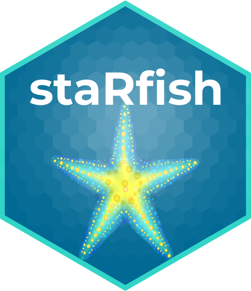

<!-- README.md is generated from README.Rmd. Please edit that file -->

```{r, include = FALSE}
knitr::opts_chunk$set(
  collapse = TRUE,
  comment = "#>",
  fig.path = "man/figures/README-",
  out.width = "100%"
)
```

# staRfish 

<!-- badges: start -->
<!-- badges: end -->

The goal of staRfish is to perform RNA-protein correlation analyses on data from [cBioPortal](https://www.cbioportal.org/).

## Installation

You can install the development version of staRfish from [GitHub](https://github.com/) with:

``` r
# install.packages("devtools")
devtools::install_github("buenoalvezm/staRfish")
```

## Example

This is a basic example which shows you how start the shiny app to run your analyses:

```{r example}
#library(staRfish)
## basic example code
```


